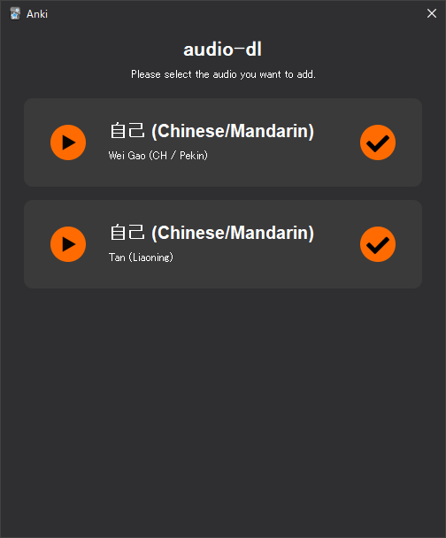

# audio-dl

Anki plugin that pulls pronunciations from supported sources.

## Sources

- [Shtooka](https://shtooka.net/) (Arabic, Belarusian, Czech, Chinese/Mandarin, German, English, Italian, French, Dutch, Polish, Portuguese, Russian, Spanish, Swedish, Serbian, Ukrainian, Wolof, Wuu/Shanghainese)
- [Naver Dictionary](https://korean.dict.naver.com/koendict/#/main) (Korean)
- [National Institute of Korean Language's Korean-English Learners' Dictionary](https://krdict.korean.go.kr/eng) (Korean)
- [JapanesePod101](https://www.japanesepod101.com/japanese-dictionary/) (Japanese)

## Installation

1. Place `audio-dl` into `%APPDATA%\Anki2\addons21`.
2. Restart Anki.

## Usage

In note editor: Press `Ctrl+E` or click the orange button.
